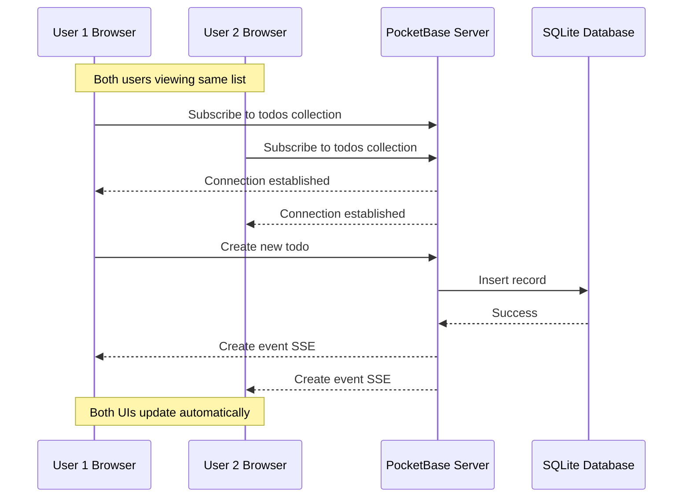
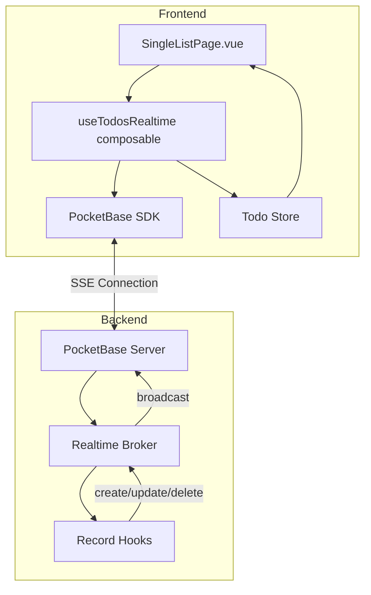

# Real-time Subscriptions for Todo Lists

## Overview

Implement real-time updates for todo lists using PocketBase's built-in SSE (Server-Sent Events) subscription feature. This allows multiple users viewing the same public list (or the owner on multiple devices) to see changes in real-time without refreshing the page.

## Research Summary

### PocketBase Realtime Capabilities

PocketBase has **built-in real-time subscription support** similar to Firebase. Key features:

1. **SSE-based**: Uses Server-Sent Events for push notifications
2. **Collection subscriptions**: Subscribe to all changes or specific records
3. **Event types**: `create`, `update`, `delete`
4. **Access control**: Respects collection view/list rules for subscriptions
5. **Filtering**: Supports expand, filter, fields, and custom query params

### SDK API (PocketBase JS SDK v0.26.5)

```typescript
// Subscribe to all changes in a collection
const unsubscribe = await pb.collection("todos").subscribe("*", (e) => {
  // e.action = "create" | "update" | "delete"
  // e.record = the affected record
});

// Subscribe to a specific record only
const unsubscribe = await pb.collection("todos").subscribe("RECORD_ID", (e) => {
  // only changes to this specific record
});

// Subscribe with filter (for specific list's todos)
const unsubscribe = await pb.collection("todos").subscribe("*", (e) => {
  // handle event
}, {
  filter: `list = "${listId}"`
});

// Unsubscribe from specific topic
await pb.collection("todos").unsubscribe("*");
await pb.collection("todos").unsubscribe("RECORD_ID");

// Unsubscribe from all collection subscriptions
await pb.collection("todos").unsubscribe();
```

## Architecture

### Data Flow Diagram



### Component Architecture



## Implementation Plan

### 1. Create Realtime Composable

Create [`frontend/src/composables/useTodosRealtime.ts`](frontend/src/composables/useTodosRealtime.ts:1):

```typescript
import { ref, onUnmounted, watch, type Ref } from 'vue';
import { pb } from 'src/services/pocketbase';
import type { TodoItem } from 'src/stores/todo';
import type { RecordSubscription } from 'pocketbase';

export function useTodosRealtime(
  listId: Ref<string | null>,
  todos: Ref<TodoItem[]>
) {
  const isConnected = ref(false);
  let unsubscribe: (() => void) | null = null;

  const handleEvent = (e: RecordSubscription<TodoItem>) => {
    switch (e.action) {
      case 'create':
        // Add new todo if it belongs to current list
        if (e.record.list === listId.value) {
          // Check if not already in the list (avoid duplicates from own actions)
          if (!todos.value.find(t => t.id === e.record.id)) {
            todos.value.unshift(e.record);
          }
        }
        break;
        
      case 'update':
        const updateIndex = todos.value.findIndex(t => t.id === e.record.id);
        if (updateIndex !== -1) {
          todos.value[updateIndex] = e.record;
        }
        break;
        
      case 'delete':
        todos.value = todos.value.filter(t => t.id !== e.record.id);
        break;
    }
  };

  const subscribe = async (newListId: string) => {
    // Unsubscribe from previous subscription if exists
    await unsubscribeAll();
    
    try {
      // Subscribe to all todos changes, filtered by list
      unsubscribe = await pb.collection('todos').subscribe<TodoItem>(
        '*',
        handleEvent,
        { filter: `list = "${newListId}"` }
      );
      isConnected.value = true;
    } catch (error) {
      console.error('Failed to subscribe to realtime updates:', error);
      isConnected.value = false;
    }
  };

  const unsubscribeAll = async () => {
    if (unsubscribe) {
      unsubscribe();
      unsubscribe = null;
    }
    isConnected.value = false;
  };

  // Watch for list changes and re-subscribe
  watch(listId, async (newId) => {
    if (newId) {
      await subscribe(newId);
    } else {
      await unsubscribeAll();
    }
  }, { immediate: true });

  // Cleanup on unmount
  onUnmounted(() => {
    void unsubscribeAll();
  });

  return {
    isConnected,
    unsubscribe: unsubscribeAll,
  };
}
```

### 2. Update SingleListPage.vue

Integrate the composable into the page:

```typescript
// In SingleListPage.vue <script setup>
import { useTodosRealtime } from 'src/composables/useTodosRealtime';

// ... existing code ...

const currentListId = computed(() => list.value?.id ?? null);

// Enable realtime updates
const { isConnected } = useTodosRealtime(currentListId, todos);
```

Add optional connection status indicator:

```vue
<!-- Optional: Show realtime connection status -->
<q-badge 
  v-if="list" 
  :color="isConnected ? 'positive' : 'warning'"
  class="q-ml-sm"
>
  <q-icon :name="isConnected ? 'wifi' : 'wifi_off'" size="xs" class="q-mr-xs" />
  {{ isConnected ? 'Live' : 'Offline' }}
</q-badge>
```

### 3. Handle Edge Cases

#### 3.1 Duplicate Prevention
When the owner creates a todo, the store already adds it locally. The realtime event will also arrive. We need to avoid duplicates:

```typescript
case 'create':
  if (!todos.value.find(t => t.id === e.record.id)) {
    todos.value.unshift(e.record);
  }
  break;
```

#### 3.2 Connection Recovery
PocketBase SDK handles automatic reconnection. We should track connection state:

```typescript
// The SDK fires a special "PB_CONNECT" event on connection
// We can listen for connection state changes
```

#### 3.3 List Changes Subscription (Optional Enhancement)
For list metadata changes (title, is_public), subscribe to the list record:

```typescript
// Subscribe to the specific list record for metadata changes
pb.collection('todo_lists').subscribe(listId, (e) => {
  if (e.action === 'update') {
    list.value = e.record;
  } else if (e.action === 'delete') {
    // List was deleted, redirect user
    router.push('/');
  }
});
```

### 4. Files to Modify

| File | Changes |
|------|---------|
| [`frontend/src/composables/useTodosRealtime.ts`](frontend/src/composables/useTodosRealtime.ts:1) | **NEW** - Create realtime subscription composable |
| [`frontend/src/pages/SingleListPage.vue`](frontend/src/pages/SingleListPage.vue:1) | Import and use composable, optional UI indicator |
| [`frontend/src/stores/todo.ts`](frontend/src/stores/todo.ts:1) | Minor cleanup - ensure local updates don't conflict with realtime |

### 5. Optional Enhancements

#### 5.1 List Realtime Composable
Create a separate composable for list metadata changes:

```typescript
// frontend/src/composables/useListRealtime.ts
export function useListRealtime(
  listId: Ref<string | null>,
  list: Ref<TodoList | null>,
  onDelete: () => void
) {
  // Similar implementation for list record subscription
}
```

#### 5.2 Connection Status Toast
Show a toast notification when connection is lost/restored:

```typescript
watch(isConnected, (connected, wasConnected) => {
  if (wasConnected !== undefined) {
    if (connected) {
      $q.notify({ type: 'positive', message: 'Real-time sync restored' });
    } else {
      $q.notify({ type: 'warning', message: 'Real-time sync lost' });
    }
  }
});
```

## Security Considerations

1. **Access Rules Apply**: PocketBase's realtime subscriptions respect collection rules:
   - Anonymous users can only receive events for public lists
   - Authenticated users receive events based on their permissions
   
2. **Filter Validation**: The filter parameter is validated server-side

3. **No Additional Backend Changes**: PocketBase handles authorization automatically

## Testing Plan

1. **Basic Flow**:
   - Open same list in two browser tabs
   - Create/update/delete todos in one tab
   - Verify changes appear in other tab

2. **Public List**:
   - Owner opens list in one browser
   - Anonymous user opens same public list
   - Owner makes changes
   - Verify anonymous user sees updates

3. **Connection Recovery**:
   - Open list page
   - Disconnect network briefly
   - Reconnect
   - Verify subscription resumes

4. **List Switching**:
   - Navigate between different lists
   - Verify subscriptions are properly cleaned up

## TODO Checklist

- [x] Research PocketBase realtime subscription API usage in JS SDK
- [ ] Create a composable for realtime subscription management
- [ ] Update todo store to handle realtime events  
- [ ] Modify SingleListPage.vue to subscribe to todos changes
- [ ] Handle subscription lifecycle on mount/unmount and route changes
- [ ] Test with multiple browser tabs/windows
- [ ] Handle edge cases like connection loss and reconnection