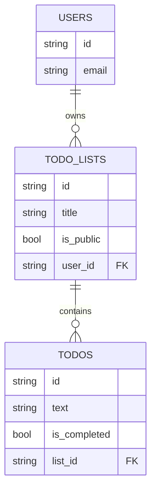

# Architecture Specification: PocketBase + Quasar Todo App

## 1. Overview
A simple Todo application allowing users to manage multiple todo lists. Users can mark lists as public to share them.

## 2. Tech Stack
- **Backend:** PocketBase (Go-based, single file database + auth + API).
- **Frontend:** Quasar Framework (Vue 3, Vite).
- **Language:** TypeScript (Frontend).

## 3. Data Model (PocketBase)

### Collections

#### `users` (System)
- Standard PocketBase user collection.

#### `todo_lists`
- `title`: Text, required.
- `user`: Relation (single) to `users`. Cascade delete.
- `is_public`: Boolean. Default `false`.

**API Rules:**
- **List/View:** `user = @request.auth.id || is_public = true`
- **Create:** `@request.auth.id != ""` (Authenticated)
- **Update:** `user = @request.auth.id`
- **Delete:** `user = @request.auth.id`

#### `todos`
- `text`: Text, required.
- `is_completed`: Boolean. Default `false`.
- `list`: Relation (single) to `todo_lists`. Cascade delete.

**API Rules:**
- **List/View:** `list.user = @request.auth.id || list.is_public = true`
- **Create:** `list.user = @request.auth.id` (Ensure user owns the list they are adding to)
- **Update:** `list.user = @request.auth.id`
- **Delete:** `list.user = @request.auth.id`

## 4. Frontend Architecture

### Project Structure
Standard Quasar structure.

### State Management (Pinia)
- `authStore`: Manages user session (login, logout, user data).
- `todoStore`: Manages fetching lists and items.

### Routing
- `/login`: Login page.
- `/register`: Registration page.
- `/`: Dashboard (Redirects to login if not auth). Shows user's lists.
- `/lists/:id`: View specific list.
- `/public`: View public lists.

### Components
- `AuthLayout`: For Login/Register.
- `MainLayout`: With drawer for navigation.
- `TodoList`: Component to display items.
- `TodoItem`: Component for single item.

## 5. Deployment / Build
- `Makefile` to orchestrate:
    - `make dev`: Run backend and frontend in dev mode.
    - `make build`: Build frontend.
    - `make setup`: Download PocketBase.

## 6. Implementation Plan (Todo)

- [ ] **Setup**
    - [ ] Create `Makefile` for project management.
    - [ ] Download PocketBase and place in `backend/`.
    - [ ] Initialize Quasar project in `frontend/`.
- [ ] **Backend Configuration**
    - [ ] Start PocketBase.
    - [ ] Create `todo_lists` collection via Admin UI.
    - [ ] Create `todos` collection.
    - [ ] Set API rules.
- [ ] **Frontend - Core**
    - [ ] Install `pocketbase` SDK.
    - [ ] Setup `authStore` with Pinia.
    - [ ] Create Login/Register pages.
    - [ ] Implement Auth Guard for routes.
- [ ] **Frontend - Features**
    - [ ] Create Dashboard (List of Todo Lists).
    - [ ] Create "Create New List" dialog.
    - [ ] Create List Detail view (Add/Edit/Delete Todos).
    - [ ] Implement "Public" toggle for lists.
    - [ ] Create Public Lists view.